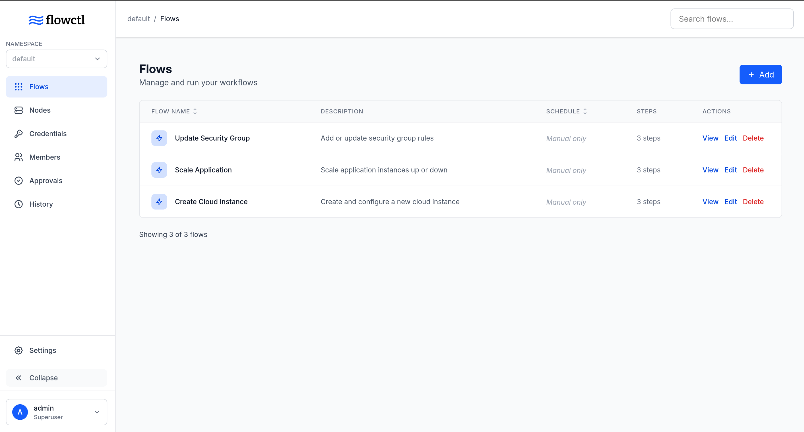

<a href="https://zerodha.tech">
  
</a>

<br clear="all" />

<div align="center">
    <picture>
        <source srcset="./docs/site/static/images/full-logo.svg" media="(prefers-color-scheme: light)">
        
    </picture>
</div>
<h4 align="center">An open-source self-service workflow execution platform</h4>

<div align="center">
    <a href="https://flowctl.net"></a>
</div>
<br/>
  

Flowctl is a self-service platform that gives users secure access to complex workflows, all in a single binary. These workflows could be anything, granting SSH access to an instance, provisioning infra, or custom business process automation. The executor paradigm in flowctl makes it domain-agnostic.  

Check out the [demo](https://demo.flowctl.net) to see it in action.

## Features

- **Workflows** - Define complex workflows using simple YAML/[HUML](https://huml.io) configuration with inputs, actions, and approvals
- **SSO** - Secure authentication using OIDC
- **Approvals** - Add approvals to sensitive operations
- **Teams** - Organize workflows by teams or projects with isolated namespaces and built-in RBAC
- **Remote Execution** - Execute workflows on remote nodes via SSH
- **Secure Secrets** - Store SSH keys, passwords, and secrets securely with encrypted storage
- **Real-time Logs** - Track workflow executions with streaming logs
- **Scheduling** - Automate workflows with cron-based scheduling

## Quick Start

### Prerequisites

- PostgreSQL database
- Docker

### Installation

#### Docker

Use the provided [docker-compose.yml](https://raw.githubusercontent.com/cvhariharan/flowctl/refs/heads/master/docker-compose.yaml) file.

---

#### Binary

1. Download the latest binary from [releases](https://github.com/cvhariharan/flowctl/releases)

2. Generate configuration:

   ```bash
   ./flowctl --new-config
   ```

3. Database migrations:

   ```bash
   ./flowctl install
   ```

4. Start the server and visit `http://localhost:7000`:

   ```bash
   ./flowctl start
   ```

## Example Workflow

```yaml
metadata:
  id: hello_world
  name: Hello World
  description: A simple greeting flow

inputs:
  - name: email
    type: string
    label: Email
    validation: email matches "^[a-zA-Z0-9._%+-]+@[a-zA-Z0-9.-]+\\.[a-zA-Z]{2,}$"
    required: true

actions:
  - id: greet
    name: Greet User
    executor: docker
    variables:
      - username: "{{ inputs.email }}"
    with:
      image: docker.io/alpine
      script: |
        echo "Hello, $username!"
```

## Custom Branding

Flowctl supports custom branding to match your organization's identity. Configure it under `[app.branding]` in `config.toml` or via environment variables.

```toml
[app.branding]
  app_name = "ACME Flowctl"
  logo_url = "/branding/logo.svg"
  logo_light_url = "/branding/logo-light.svg"
  favicon_url = "/branding/favicon.png"
  primary_color = "#e4002b"
  sidebar_color = "#1a1a2e"
  branding_dir = "/app/branding"
```

| Field | Description | Default |
|-------|-------------|---------|
| `app_name` | Custom page title | "Flowctl" |
| `logo_url` | Logo for light theme (local path or URL) | Embedded logo |
| `logo_light_url` | Logo for dark theme | Falls back to `logo_url` |
| `favicon_url` | Favicon (local path or URL) | Embedded favicon |
| `primary_color` | Primary color (hex) | `#155DFC` |
| `sidebar_color` | Sidebar background color (hex) | Theme default |
| `branding_dir` | Local directory to serve at `/branding/` | Not set |

Each field is optional and independent — configure only what you need, the rest falls back to defaults.

**Environment variables:** use the `FLOWCTL_APP__BRANDING__` prefix, e.g.:

```bash
FLOWCTL_APP__BRANDING__APP_NAME="ACME Flowctl"
FLOWCTL_APP__BRANDING__PRIMARY_COLOR="#e4002b"
FLOWCTL_APP__BRANDING__FAVICON_URL="https://example.com/favicon.png"
```

**Docker/Podman with custom logos:**

```yaml
volumes:
  - ./branding:/app/branding:ro
environment:
  FLOWCTL_APP__BRANDING__APP_NAME: "ACME Flowctl"
  FLOWCTL_APP__BRANDING__LOGO_URL: "/branding/logo.svg"
  FLOWCTL_APP__BRANDING__BRANDING_DIR: "/app/branding"
```

## Documentation

Full documentation is available at [flowctl.net](https://flowctl.net)

## Contributing

Contributions are welcome! Please open an issue or submit a pull request.

## License

flowctl is licensed under the Apache 2.0 license.

## Third-Party Data

- **Timezone data** from [timezones-list](https://github.com/omsrivastava/timezones-list)
  - Copyright (c) 2020 Om Srivastava
  - MIT License - [Full text](https://github.com/omsrivastava/timezones-list/blob/master/LICENSE)
