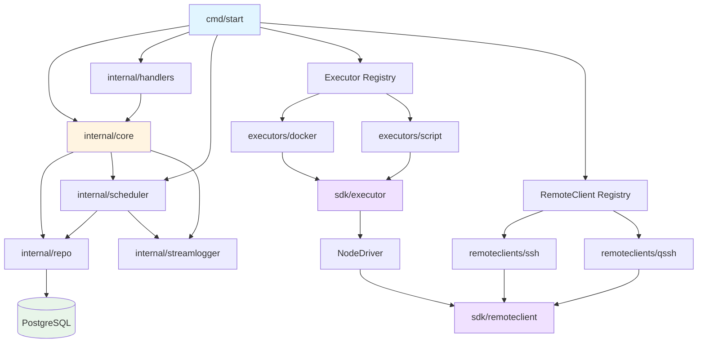

## Overview

flowctl is a Go-based workflow execution platform using a **modular architecture** with separate SDKs for executors and remote clients. All modules are compiled into the binary.

## Core Components

### Application Layer

- **cmd/**: CLI entry points (start, migrate)
- **internal/core**: Business logic (flows, credentials, approvals, RBAC)
- **internal/handlers**: REST API endpoints
- **internal/scheduler**: Task queue and worker pool
- **internal/repo**: PostgreSQL data access layer
- **internal/streamlogger**: Real-time log streaming

### Module SDKs

- **sdk/executor**: Executor interface and NodeDriver abstraction
- **sdk/remoteclient**: Remote connection protocol interface

### Executor Implementations

- **executors/docker**: Docker container executor
- **executors/script**: Shell script executor

### Remote Client Implementations

- **remoteclients/ssh**: Standard SSH connections
- **remoteclients/qssh**: QUIC-based SSH alternative

### Frontend

- **site/**: SvelteKit UI (TypeScript/Tailwind)

## Internal Package Dependencies

