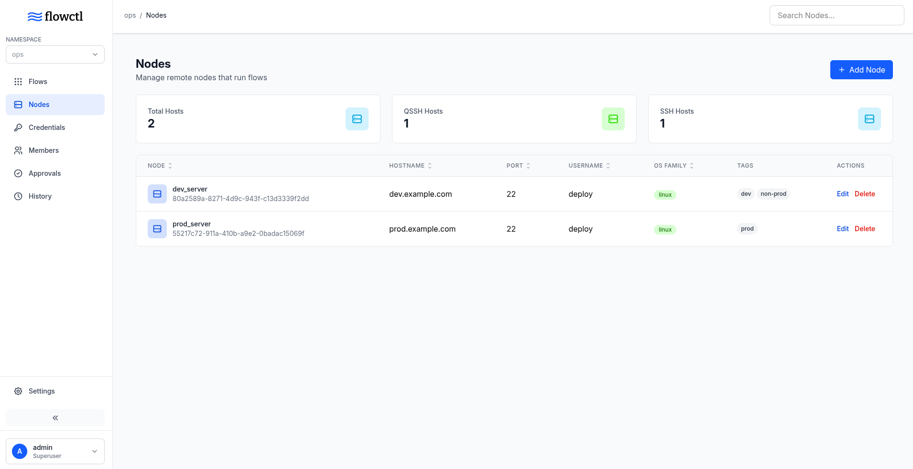
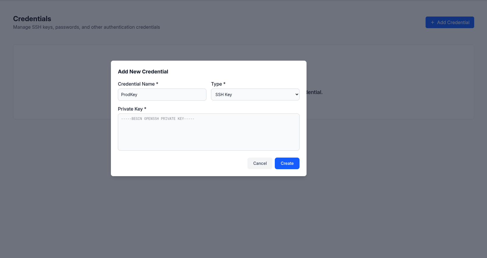
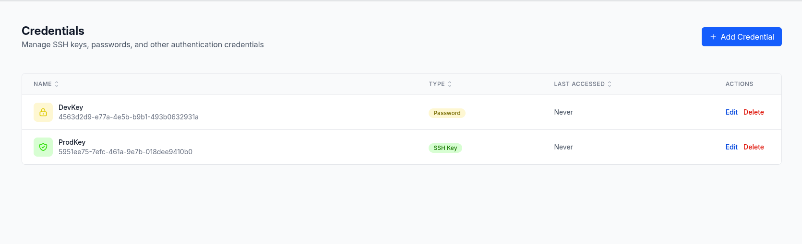
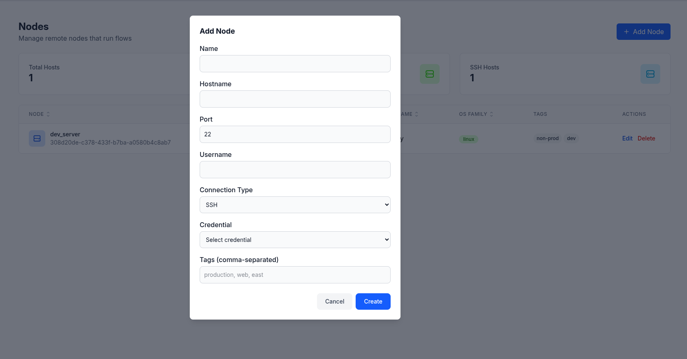

import { Aside } from "@astrojs/starlight/components";

## Overview

Flowctl allows you to execute workflows both locally and on remote nodes.

## Executors

Executors define how your actions run. Flowctl provides two built-in executors:

### Docker Executor

The Docker executor runs your scripts inside Docker containers.

**Configuration:**

```yaml
- id: build_app
  name: Build Application
  executor: docker
  variables:
    - version: "{{ inputs.version }}"
  with:
    image: docker.io/node:18
    script: |
      npm install
      npm run build
      echo "BUILD_ID=$(date +%s)" >> $FC_OUTPUT
```

**Config:**

- **`image`**: Docker image
- **`script`**: Bash script to execute inside the container

### Script Executor

The Script executor runs shell scripts directly on the host system (local or remote).

**Configuration:**

```yaml
- id: deploy
  name: Deploy Application
  executor: script
  variables:
    - app_name: "{{ inputs.app_name }}"
  with:
    script: |
      cd /opt/$app_name
      git pull origin main
      systemctl restart $app_name
      echo "DEPLOYED_AT=$(date -Iseconds)" >> $FC_OUTPUT
    interpreter: /bin/bash # Optional, defaults to /bin/bash
```

**Key Features:**

- **`script`**: Script to execute. Could be anything the interpreter can execute.
- **`interpreter`**: Path to interpreter

<Aside type="caution">
  Script executor actions run with the permissions of the flowctl process on
  local nodes and the user configured on remote nodes. Ensure proper security
  measures are in place.
</Aside>

## Remote Nodes

A remote node is any server or machine that flowctl can connect to via a remote client (SSH).

### Setting Up Remote Nodes



#### Step 1: Create a Credential



Before adding a node, create SSH credentials:

1. Navigate to **Credentials**
2. Click **Add Credential**
3. Provide:
   - **Name**: Descriptive name (e.g., "Production Server SSH Key")
   - **Type**: `private_key` or `password`
   - **Key Data**: SSH private key or password



#### Step 2: Add a Node

1. Navigate to **Nodes**
2. Click **Add Node**
3. Configure the node:



**Fields:**

- **Name**: Unique identifier used in flow definitions
- **Hostname**: IP address or domain name
- **Port**: SSH port (default: 22)
- **Username**: SSH username
- **Connection Type**: `ssh` or `qssh` (QUIC-based SSH)
- **Credential**: SSH authentication credential
- **Tags**: Optional labels for organization

### Using Remote Nodes in Flows

Execute actions on remote nodes using the `on` field. This will be the node name:

```yaml
actions:
  - id: remote_deploy
    name: Deploy to Production
    executor: script
    on:
      - WebServer1
      - WebServer2
    variables:
      - version: "{{ inputs.version }}"
    with:
      script: |
        cd /var/www/app
        git fetch --all
        git checkout $version
        sudo systemctl restart app
```

**Key Points:**

- Actions run on **all specified nodes in parallel**
- Each node receives the same inputs and variables
- Outputs are collected from all nodes
- If any node action fails, the entire flow will fail

## Next Steps

- Learn about [Flow Secrets](/general/flows#flow-secrets) for secure credential management
- Review [Access Control](/general/access-control) for multi-user environments
